# Customer Shopping Behavior Analysis

This end-to-end project involved importing a Kaggle dataset into Jupyter Notebook for feature engineering and cleaning, then exporting to CSV. Key business queries were answered using MySQL, followed by an interactive Power BI dashboard and final business recommendations.

### 1. Project Overview
* This project analyzes customer shopping behavior using 3,900 transactions across various product categories. The goal is to uncover insights and guide strategic business decisions.

### 2. Dataset Summary
* **Rows:** 3900
* **Columns:** 18
* **Key Features:**
  * **Customer demographics:** `customer_id`, `age`, `gender`, `location`, `subscription_status`, `age_group`
  * **Purchase details:** `item_purchased`, `category`, `purchase_amount`, `color`, `season`
  * **Shopping behavior:** `review_rating`, `shipping_type`, `discount_applied`, `previous_purchases`, `payment_method`, `frequency_of_purchases`, `purchase_frequency_days`

### 3. Exploratory Data Analysis Using Python
* **Data Loading:** Imported the dataset using Pandas in Jupyter Lab.
* **Initial Exploration:** Used `df.info()` to check the overall structure, `df.isnull().sum()` to check for null values, `df.head()` to view the first 5 rows, and `df.describe(include="all")` for summary statistics.
* **Column Standardization:** Renamed columns to snake_case for consistency.
* **Feature Engineering:**
  * Created `age_group` column by binning customer ages.
  * Created `purchase_frequency_days` column from `frequency_of_purchases`.
* **Data Consistency Check:** Verified that `discount_applied` and `promo_code_used` were redundant; dropped `promo_code_used`.
* **Export:** Saved the cleaned DataFrame to `Customer Shopping Behaviour Dataset.csv`.

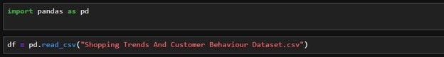

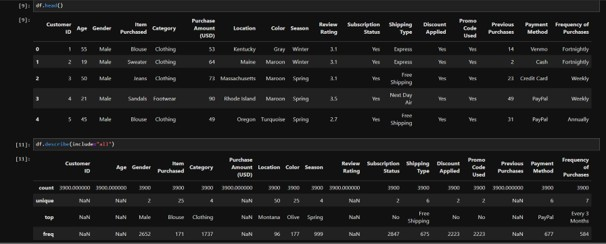

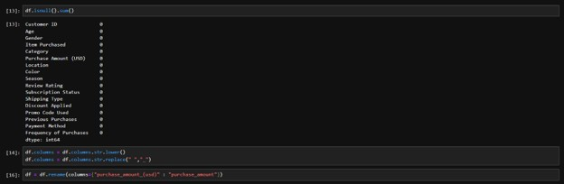

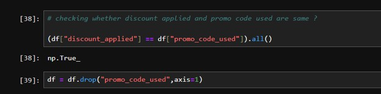

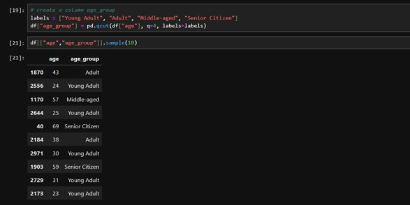

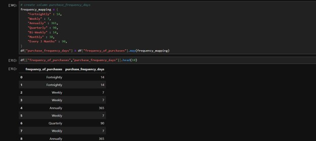

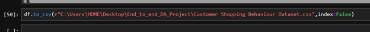

### 4. Data Analysis Using MySQL

**I. Revenue by Gender** – Compared total revenue generated by male vs. female customers.

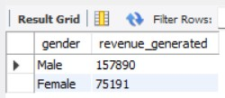

**II. High-Spending Discount Users** – Identified customers who spent higher than average purchase amount even on discount.

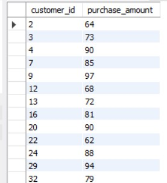

**III. Top 5 Products by Rating** – Identified products with the highest average review ratings.

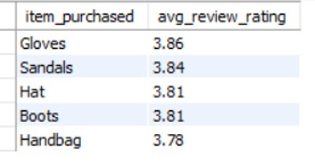

**IV. Shipping Impact** – Analyzed the influence of shipping type (standard vs. express) on purchase amounts.

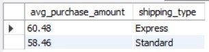

**V. Subscriber vs Non-Subscriber Value** – Identified high-value customers based on spend and revenue contribution across subscription types.

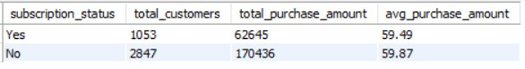

**VI. Top 5 Discounted Products** – Identified the products with the highest percentage of discounted purchases.

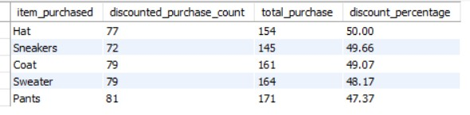

**VII. Customer Segmentation** – Segmented customers into New, Returning, and Loyal groups based on previous purchases to optimize targeted offers.

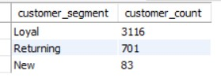

**VIII. Top 3 Products per Category** – Identified the top 3 most purchased items within each product category.

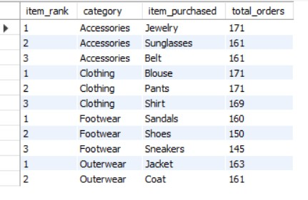

**IX. Subscription Status of Repeat Buyers** – Evaluated subscription adoption among repeat customers (5+ previous purchases).

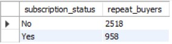

**X. Revenue Contribution by Age Group** – Pinpointed key target demographic segments by revenue generation.

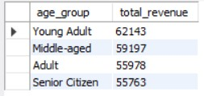

### 5. Interactive Power BI Dashboard Design

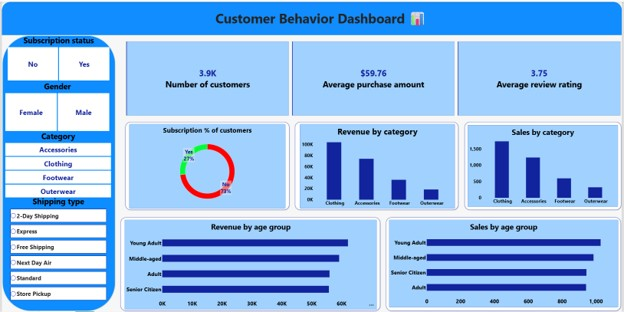

### 6. Final Reporting & Stakeholder Presentation
* Compiled detailed analytical findings into a structured business report.
* Leveraged Gamma AI to build an executive presentation deck summarizing findings and strategic recommendations.

*(Note: PDFs cannot be rendered inline via image tags on GitHub. Link directly to the file instead:)*  
📄 [View Presentation PDF](Customer-Shopping-Behavior-Analysis.pdf)

### 7. Business Recommendations
* **Boost Subscriptions:** Introduce enhanced perks and exclusive discounts for subscribers.
* **Customer Loyalty Programs:** Implement tiered rewards to convert returning customers into loyal brand advocates.
* **Product Positioning:** Highlight top-rated and best-selling items in marketing campaigns.
* **Targeted Marketing:** Focus promotional budgets on high-revenue age groups and express-shipping preferences.
